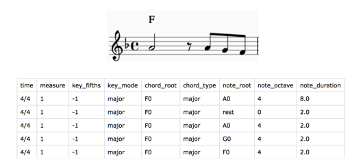

## Auto-Harmonization of Symbolic Melodies using CNNs


 Aldo Aguilar, Alex Reneau, Yijing Barry Zhang
  
Northwestern University Comp_Sci 496, Deep Learning
Professor Bryan Pardo

aldoaguilar2022@u.northwestern.edu  
alexreneau2021@u.northwestern.edu  
yijingzhang2021@u.northwestern.edu

Check out some of the harmonization produced by our model:  
[song 1]()  
[song 2]()  
 
 
### Music harmonization and Deep Learning

### Our Project

### Experiment Setup
* Dataset  
  
 Music Format:
 []
 The original dataset used in the paper can be found [here](http://marg.snu.ac.kr/chord_generation/#)
* Model
* Loss Function/Error Measure

### Results


[paper](www.google.com)


### Markdown

Markdown is a lightweight and easy-to-use syntax for styling your writing. It includes conventions for

```markdown
Syntax highlighted code block

# Header 1
## Header 2
### Header 3

- Bulleted
- List

1. Numbered
2. List

**Bold** and _Italic_ and `Code` text

[Link](url) and 
```

For more details see [GitHub Flavored Markdown](https://guides.github.com/features/mastering-markdown/).


### Support or Contact

Having trouble with Pages? Check out our [documentation](https://docs.github.com/categories/github-pages-basics/) or [contact support](https://github.com/contact) and we’ll help you sort it out.
